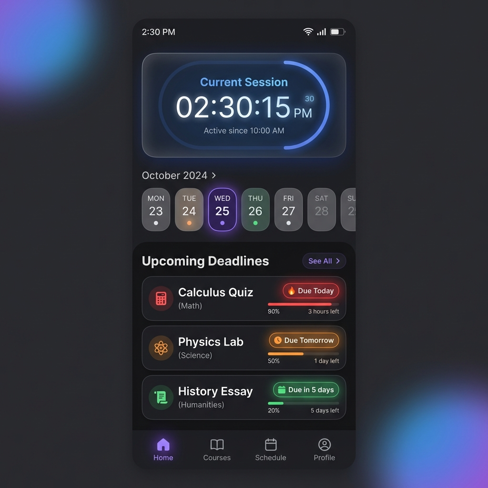
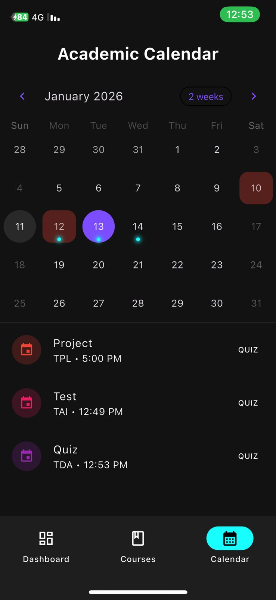
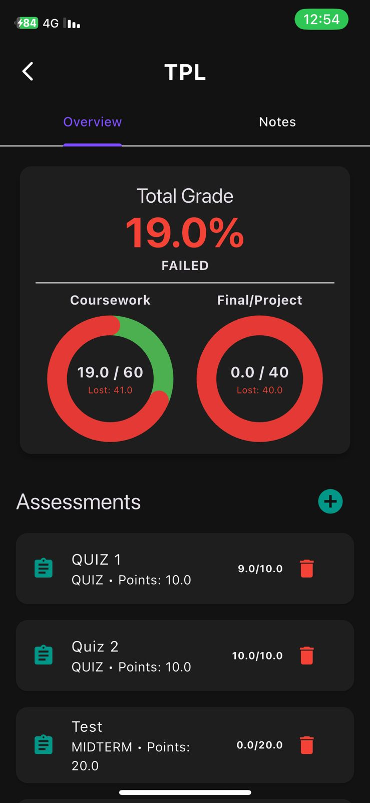

# UniTask - The Ultimate Student Companion
**TPL6213 - Programming Language Concept** | Group Project Sample Application

<p align="center">
  
  
  
</p>

---

## 👥 Group Members


| No. | Student Name | Student ID |
| :--- | :--- | :--- |
| 1. | [Hamed Albazeli] | [243UT246MV] |
| 2. | [Mohammed Khaled]] | [243UT2461U] |
| 3. | [Saloglu Youssof] | [243UT24629] |
| 4. | [Almamary Oseid] | [241UE24169] |

---

## 📖 Project Overview

This project is submitted as a milestone-based group assignment for **TPL6213 - Programming Language Concept**. Our group selected **Dart** as the programming language and **Flutter** as the framework to demonstrate specific language capabilities and system functionalities.

**UniTask** serves as the **Sample Application** for our research, designed to analyze and practically demonstrate:
*   **Names and Bindings**: Variable scoping, lifetime management in stateful widgets.
*   **Expressions and Assignment**: Dart's optimized assignment operators and expression evaluation.
*   **Control Structures**: Asynchronous control flow (`Future`, `await`), loops for widget rendering, and conditional UI building.
*   **Subprograms**: Modular function design, helper methods, and widget composition.

---

## 🎯 System Functionalities Evaluated

Per the project guidelines for Dart/Flutter, this application implements the following core features:

### 1. User Interface Controls & Data Tables
*   **Dashboard**: A comprehensive view combining a digital clock, weekly calendar strip, and task lists.
*   **Course Management**: Custom data tables and list views to manage courses and assessments.
*   **Input Forms**: Validated text fields and date pickers for adding tasks (Demonstrates *Regular Expression* usage in validation).

### 2. Calendar & Time Management
*   **Smart Calendar**: Integrated `TableCalendar` with custom builders to mark deadlines.
*   **Busy Window Detection**: Logic to highlight days with high workload (demonstrating complex *Control Structures*).
*   **Timer Control**: A real-time digital clock session timer implemented using Dart's `Timer.periodic`.

### 3. Data Persistence & Error Handling
*   **Local Storage**: Implements `shared_preferences` to persist user data across sessions.
*   **Error Handling**: Robust `try-catch` blocks in `StorageService` to manage data corruption or missing files safely.

### 4. Progress Visualization
*   **Circular Indicators**: Visual representation of "Acquired", "Lost", and "Remaining" grade points.
*   **Weight Calculation**: Dynamic calculation of grades based on user-defined weights (Coursework vs. Final).

---


## 🚀 Installation & Running

To run this sample application for demonstration:

1.  **Clone the Repository**
    ```bash
    git clone https://github.com/yourusername/unitask.git
    cd unitask
    ```

2.  **Install Dependencies**
    ```bash
    flutter pub get
    ```

3.  **Run on Chrome (Web)**
    ```bash
    flutter run -d chrome
    ```
    *Note: The web build has been optimized for mobile-view simulation.*

4.  **Run on Mobile (Android/iOS)**
    ```bash
    flutter run
    ```

---

## 📂 Project Structure

```
lib/
├── main.dart               # Entry point & Theme configuration
├── dashboard_screen.dart   # Main logic (Timer, Calendar, Task List)
├── courses_screen.dart     # Course management UI
├── course_detail_screen.dart # Grade calculation & Data visualization
├── storage_service.dart    # Data persistence (Subprograms example)
└── models/                 # Data models (Names & Bindings example)
```

---

Built with ❤️ by **Powe performers Team** for TPL6213.
